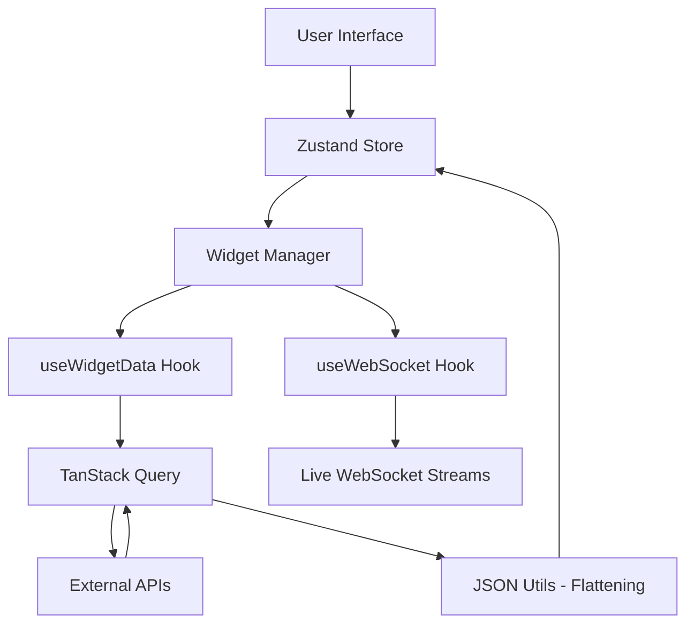

# 📊 FinBoard: Customizable Finance Dashboard

FinBoard is a high-performance, real-time finance monitoring dashboard built with **Next.js 14**. It empowers users to build their own monitoring suite by connecting to any financial API and visualizing data through dynamic, customizable widgets.

## 🔗 Project Links
- [**Live Demo**](https://finboard-ochre-mu.vercel.app/)
- **Video Walkthrough**: [https://drive.google.com/file/d/1sS5uDomUPWZPp-BZkEmRm2ggQS8M3G4E/view?usp=sharing](https://drive.google.com/file/d/1sS5uDomUPWZPp-BZkEmRm2ggQS8M3G4E/view?usp=sharing)

---

## ✨ Key Features

- **🚀 Dynamic API Integration**: Connect to any REST API (Alpha Vantage, CoinGecko, Binance, etc.).
- **🔍 JSON Explorer**: Interactive field selection—flatten complex JSON responses into searchable paths.
- **📈 Comprehensive Widget Suite**: 
    - **Finance Cards**: Single-metric monitoring with custom formatting.
    - **Tables**: Searchable, sortable, and auto-discovering data grids.
    - **Charts**: Responsive Area and Line charts with dynamic `{RANGE}` templates.
- **🔗 Real-time Data**: Native WebSocket support for live ticker streams.
- **🎛️ Dashboard Builder**: 
    - **Drag-and-Drop**: Pixel-perfect layout reorganization.
    - **Live Configuration**: Edit titles, endpoints, and formats without refreshing.
    - **Templates**: Quick-start templates for Crypto and Blue-Chip stocks.
- **🌓 Premium UI/UX**: Dark/Light mode switching with an emerald-green professional aesthetic.
- **💾 Data Persistence**: LocalStorage sync ensures your dashboard survives browser restarts.

---

## 🛠️ Tech Stack

- **Frontend**: Next.js 14 (App Router), React 18
- **Styling**: Tailwind CSS, Lucide Icons
- **State Management**: Zustand (Persist Middleware)
- **Data Fetching**: TanStack Query v5 (Auto-caching & Refetching)
- **Layout**: DND Kit / React Grid Layout
- **Visualization**: Recharts
- **Deployment**: Vercel

---

## 🏗️ Architecture

### Data Flow Diagram


### Component Breakdown
- **Widget System**: A modular wrapper (`WidgetCard`) that delegates rendering to specialized components (`CardWidget`, `TableWidget`, `ChartWidget`) based on user selection.
- **API Integration**: A centralized `lib/api.ts` handler that manages fetch requests, coupled with a recursive `flattenObject` utility for dynamic mapping.
- **State Management**: Zustand handles the global list of widgets, theme, and edit-mode states, persisting strictly necessary configuration to LocalStorage.

---

## 🚀 Setup Instructions

### Prerequisites
- Node.js 18.x+
- npm

### Installation
1. **Clone the repo**:
   ```bash
   git clone https://github.com/prakarti29prabhakar2005/finboard.git
   cd finboard
   ```
2. **Install dependencies**:
   ```bash
   npm install
   ```
3. **Run Locally**:
   ```bash
   npm run dev
   ```
4. **Environment Variables**:
   Create a `.env.local` if using private API keys (e.g., `NEXT_PUBLIC_ALPHAVANTAGE_KEY=your_key`). Note: The demo currently uses public Coingecko and Binance endpoints for easier testing.

---

## ⚖️ Design Decisions

- **Why Zustand?**: Chosen for its minimal boilerplate compared to Redux, making it ideal for the highly interactive, client-side nature of a dashboard builder.
- **Real-time Strategy**: Implemented a hybrid approach:
    - **HTTP Polling**: For data that changes every 30-60s (e.g., Coingecko free tier).
    - **WebSockets**: For high-frequency trading data where available (e.g., Binance).
- **Rate Limit Handling**: Integrated TanStack Query's caching to prevent identical widgets from making redundant API calls. If a rate limit is hit, the UI gracefully displays the error while keeping cached data visible.

---

## ⚠️ Trade-offs & Limitations

- **API Rate Limits**: Public APIs (like Coingecko) have strict limits. We handle this with aggressive caching but users may see error states if refreshing too often.
- **Authentication**: To focus on the "Dashboard Builder" core, authentication is not implemented. Data is private to the user's browser (LocalStorage).
- **Single-Page Scale**: Designed as a single-page dashboard; scaling to multiple "Boards" per user would require a database backend.

---

## 📄 License
MIT License. Created by [Prakarti Prabhakar].
